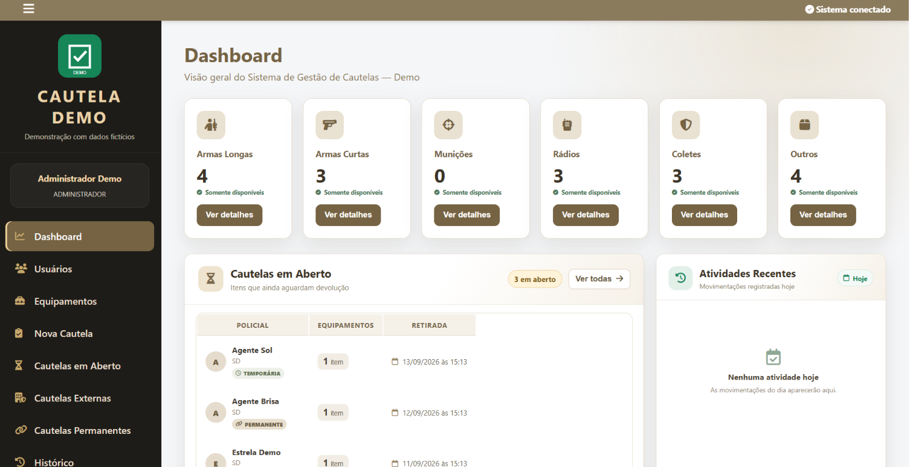

# 📦 Sistema de Gestão de Cautelas e Estoque de Equipamentos — Demo

Aplicação desktop demonstrativa para cadastro, controle, cautela, devolução e rastreabilidade de equipamentos.

> **Portfólio:** esta versão utiliza somente dados fictícios e identidade visual demonstrativa. Ela não contém bancos de produção, credenciais institucionais, inventários reais, dados pessoais ou o brasão original do sistema.

## 🎯 Sobre o projeto

O projeto surgiu a partir da necessidade de organizar, em uma única aplicação, informações relacionadas a usuários, equipamentos, retiradas, devoluções, cautelas temporárias e permanentes, histórico, relatórios e backup.

Minha participação concentrou-se na identificação do problema, levantamento de requisitos, definição das funcionalidades e regras de negócio, estruturação dos fluxos, testes, investigação de erros e evolução da solução.

## ✨ Principais funcionalidades

- autenticação demonstrativa por perfil;
- dashboard com indicadores;
- cadastro e consulta de usuários;
- cadastro e controle de equipamentos;
- cautelas temporárias, permanentes e externas;
- devolução de equipamentos;
- histórico de movimentações;
- relatórios em PDF;
- backup, restauração e exportação;
- configurações e identidade visual;
- banco de dados local SQLite.

## 🛠️ Tecnologias utilizadas

- Electron
- JavaScript
- Node.js
- SQLite
- HTML5
- CSS3
- jsPDF
- bcrypt
- Visual Studio Code

## 🧱 Arquitetura

A aplicação utiliza Electron como contêiner desktop. A interface é construída com HTML, CSS e JavaScript, enquanto a camada principal em Node.js coordena regras de negócio, acesso ao SQLite e comunicação entre processos por IPC.

```text
Interface (HTML/CSS/JS)
        ↓
Preload / IPC
        ↓
Controllers
        ↓
Repositories / Services
        ↓
SQLite local
```

## 🚀 Executar localmente

Requisitos:

- Node.js 24 LTS
- npm

Na pasta do projeto:

```sh
npm ci
npm start
```

O primeiro início cria automaticamente um banco demonstrativo isolado em `.demo-data/demo.sqlite`.

### Credenciais públicas da demonstração

| Perfil | Identificador | Senha |
| --- | --- | --- |
| Administrador | `demo` | `Demo123!` |
| Operador | `DEMO001` | `Demo123!` |
| Gestor | `DEMO002` | `Demo123!` |
| Consulta | `DEMO003` | `Demo123!` |

Todos os usuários, equipamentos, números de série, patrimônios, unidades e registros iniciais são fictícios.

## 🧪 Testes

A suíte de testes da demonstração pode ser executada com:

```sh
npm test
```

Os testes verificam, entre outros pontos, a geração dos dados fictícios, autenticação das credenciais de demonstração, consistência entre equipamentos e cautelas e preservação do banco demonstrativo.

> Como o projeto utiliza o módulo nativo `sqlite3`, a instalação precisa usar dependências compatíveis com o sistema operacional em que os testes forem executados.

## 🤖 Desenvolvimento assistido por IA

A implementação contou com forte apoio de ferramentas de Inteligência Artificial no Visual Studio Code.

Minha atuação envolveu:

- identificação do problema;
- levantamento de requisitos;
- definição de funcionalidades e regras de negócio;
- estruturação dos fluxos;
- testes e validação;
- investigação de erros;
- refinamento da interface e das funcionalidades.

Como estudante de Análise e Desenvolvimento de Sistemas, utilizo o projeto também como ambiente de aprendizado para aprofundar programação, bancos de dados, arquitetura desktop e manutenção de código.

## 🔐 Segurança e privacidade

A versão pública foi preparada especificamente para portfólio.

Não são incluídos:

- bancos de dados originais ou backups;
- dados pessoais reais;
- inventários ou identificadores institucionais;
- credenciais privadas;
- logs locais;
- `node_modules`;
- identidade visual institucional original.

Alguns nomes internos de campos e estruturas permanecem no código por compatibilidade com a arquitetura já implementada, mas os dados utilizados na demonstração são exclusivamente fictícios.

Consulte também [`SECURITY.md`](SECURITY.md).

## 📦 Gerar pacote público

O projeto inclui uma lista positiva de arquivos permitidos para publicação:

```sh
npm run demo:export
```

O comando cria `publicacao/cautela-demo-<timestamp>` sem bancos, backups, logs, dependências instaladas ou mídia institucional original.

## 💻 Sobre a demonstração

Este é um aplicativo **desktop Electron**, portanto não é executado diretamente pelo GitHub Pages.

Para avaliação por recrutadores, o repositório oferece código-fonte, documentação e instruções de execução local. Screenshots e um vídeo curto da versão demonstrativa podem ser adicionados ao portfólio.

## 🖥️ Interface da aplicação

### Dashboard


### Gestão de equipamentos


### Fluxo de cautela


### Histórico e rastreabilidade


## 📚 Principais aprendizados

- modelagem e persistência de dados com SQLite;
- operações CRUD;
- comunicação entre renderer e processo principal do Electron;
- regras de negócio para estados e movimentações;
- autenticação e perfis de acesso;
- histórico e rastreabilidade;
- geração de relatórios;
- backup e recuperação;
- testes e depuração;
- organização de aplicação desktop em módulos.

## 🚧 Status

🟡 Versão demonstrativa em evolução.

## 👨‍💻 Autor

**Emanuel Henrique**  
Estudante de Análise e Desenvolvimento de Sistemas — FPB  
Buscando oportunidade de estágio em Desenvolvimento de Software.
